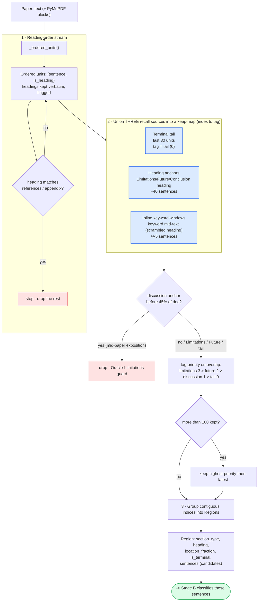
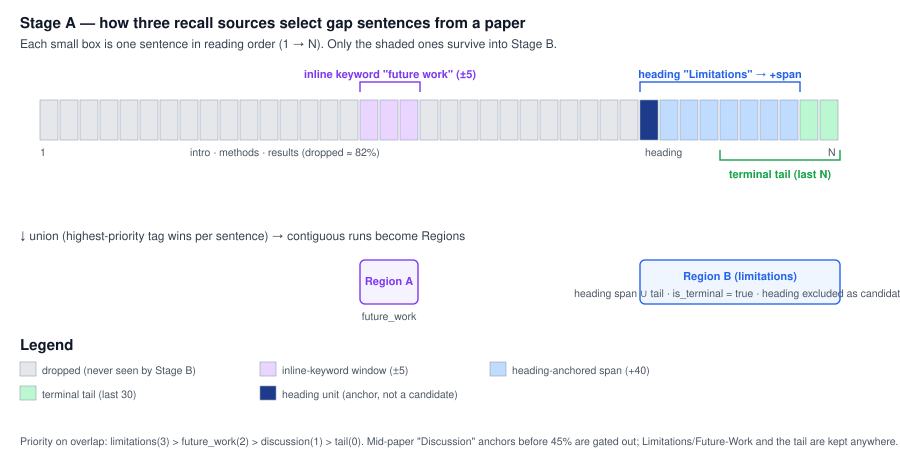

# Stage A — the structural slice, explained

> Companion to [`gap_extraction_architecture.md`](gap_extraction_architecture.md) §8.
> Code: [`src/gap2idea/pipeline/gap_funnel.py`](../src/gap2idea/pipeline/gap_funnel.py) (`slice_terminal_regions`).
> Figures are reproducible: `python scripts/bench/plot_stage_a.py`.

---

## 1. What Stage A does, in one sentence

Stage A takes a whole paper and returns the **small set of sentences that could
plausibly be a future-work or limitation gap**, throwing away the rest — using
only regex and string operations (no model, no API, linear in the number of
sentences).

It is deliberately **recall-first**. Everything downstream (the cue rules and
the embedding classifier in Stage B) can only ever label sentences that Stage A
kept, so:

> **Stage A is the recall ceiling of the entire funnel.** A real gap dropped
> here is lost forever. We therefore over-include on purpose and leave
> precision to Stage B.

And it is the part that makes the funnel **cheap**: it discards ~82 % of every
paper before any model runs.


*Per paper: ~341 sentences in the body → ~62 kept by Stage A (free, regex/CPU) →
~4.5 emitted as gaps by Stage B. The 82 % cut is what turns a ~$4,000-per-million
LLM pass into a few-dollar one.*

---

## 2. The problem that shaped the design: scrambled PDFs

Our paper text comes from PyMuPDF over two-column PDFs, and the reading order is
often **scrambled** — columns interleave. Two consequences drove every design
choice:

1. **Headings hide inside body text.** A real section title like *Limitations*
   shows up mid-paragraph, e.g.

   > *"…presents results comparing our model **Limitations** with recent
   > off-the-shelf retrievers…"*

   So we **cannot** rely on finding clean heading lines.

2. **A gap's words get scattered.** A single gap sentence can be split across
   interleaved columns, so it may not appear as one contiguous run.

A naive "find the `## Limitations` heading and read the section" approach scores
~0.30 localization recall on this data. Stage A is built to survive scrambling
and reaches **0.84** (below).

---

## 3. The algorithm



### Step 1 — Build an ordered (sentence, is_heading) stream
`_ordered_units()` walks the PDF `blocks` in reading order and produces a flat
list of units. Headings are kept **verbatim even when very short** (so the word
"Limitations" can act as an anchor) and flagged `is_heading=True` so they are
later excluded as gap candidates. The walk **stops** at the first heading
matching `references | bibliography | appendix | appendices | supplementary`, so
the gap-bearing body ends before the references/appendices. (No blocks → fall
back to splitting the pre-references plain text.)

### Step 2 — Union three complementary recall sources
A sentence is kept if **any** of three independent signals flags it. They are
complementary by design, so a gap is rarely missed:

| Source | What it catches | Reach |
|---|---|---|
| **Terminal tail** | Unheaded conclusions / future-work; the safety net when heading detection fails on scrambled PDFs | last **30** units |
| **Heading anchors** | Properly-structured sections (a heading matching *Limitations / Future Work / Conclusion*) | **+40** sentences after the heading |
| **Inline keyword windows** | Scrambled headings hidden inside body text | **±5** sentences around the keyword |

The picture below shows the three sources selecting sentences from one paper's
stream and merging into Regions:



### Step 3 — Position gate (the "Oracle Limitations" guard)
A generic **Discussion / Conclusion** anchor that sits before **45 %** of the
document is dropped — mid-paper discussion is exposition, not the authors' own
gaps. (This is the trap where a results section titled *"Oracle Limitations"*
would otherwise be swept in.) **Limitations and Future-Work anchors are trusted
at any position**, and the terminal tail is always kept, because real gaps of the
authors' own work cluster near the end.

### Step 4 — Cap the load by priority, not position
If more than **160** sentences survive, keep the highest-**priority**-then-latest
(`limitations(3) > future_work(2) > discussion(1) > tail(0)`). A position-only
cap was a real bug: in a 249 K-character paper it dropped a genuine mid-paper
Limitations section in favour of appendix tail.

### Step 5 — Group into Regions
Contiguous kept indices become a `Region` with: `section_type` (the
highest-rank tag in the run), `location_fraction`, `is_terminal`, and
`sentences` — the **candidates** handed to Stage B (non-heading units ≥ 25
chars; the heading itself is an anchor, not a candidate).

---

## 4. A worked example

For paper `2309.09902`, the heading "Limitations" is buried inline in scrambled
text, so clean-heading detection fails — but the **inline-keyword window**
anchors on it and pulls in the surrounding sentences, so the slice contains:

> *"We did not study risks that may or may not arise when our fine-tuned large
> language models are used for other application scenarios than ours."*

That sentence then reaches Stage B, where a cue rule (`we did not …`) labels it
`limitation`. Without Stage A's scramble-robust anchoring it would never have
been seen.

---

## 5. Results


Measured on the clean gold (`data/bench_gap/gold_sentences.tsv`, 19 verified gap
sentences over 9 papers; see architecture doc §8.2):

| containment τ | recall (all) | future_work | limitation |
|---|---|---|---|
| 0.90 | 0.74 | 0.82 | 0.63 |
| **0.80** | **0.84** | **0.91** | 0.75 |
| 0.70 | 0.89 | 1.00 | 0.75 |

- **future_work localization is effectively solved** (0.91 at τ = 0.80, 1.00 at 0.70).
- Recall is reported at several **containment** thresholds (fraction of the gold
  sentence's words present in the slice), not as exact substring match, because
  19/27 gold gaps are PDF-scrambled — at τ = 0.90 a single word scattered into
  another column can drop an otherwise-present gap.
- Stage A drops **82 %** of sentences for free (341 → 62 per paper).

---

## 6. Known limitations

1. **Mid-paper own-work limitations.** A limitation stated in the *setup*
   (not in a Limitations section), e.g. *"randomized smoothing requires a
   classifier robust to large Gaussian noise…"*, is not terminal and is missed.
   This is structural, not a slicer bug — it is the same discourse-level problem
   that makes `open_problem` hard (architecture doc §5.2), which is why those
   cases are left to the LLM.
2. **Sentence-splitting quality.** Stage A inherits whatever `split_sentences`
   produces on noisy text.
3. **Severe scrambling.** When a gap's words are scattered across very distant
   units, the *content* is in the slice but a strict containment check
   undercounts it (the τ-sensitivity above is exactly this).

---

## 7. Parameters (and why)

| Constant | Value | Rationale |
|---|---|---|
| `TAIL_SENTS` | 30 | Heading detection is unreliable on scrambled PDFs; the tail is the robust catch-all |
| `HEADING_SPAN` | 40 | Long, bulleted Limitations sections need a generous reach |
| `KW_WINDOW` | 5 | An inline keyword marks a *local* gap, not a whole section |
| `TERMINAL_THRESHOLD` | 0.45 | Gates only mid-paper *Discussion*; Limitations/Future trusted anywhere |
| `MAX_SLICE_SENTS` | 160 | Bounds Stage-B load; generous because the load is cheap |
| `MIN_SENT_CHARS` | 25 | A candidate gap must be a substantive sentence |

---

## 8. Reproduce

```bash
# regenerate both data plots from the live code + gold
python scripts/bench/plot_stage_a.py --head data/gap_head.joblib

# full staged benchmark (Stage A recall + Stage B + end-to-end)
python scripts/bench/bench_gap_recall.py --head data/gap_head.joblib
```

Figures: [`figures/stage_a_flow.mmd`](figures/stage_a_flow.mmd) (flow source),
[`figures/stage_a_union.svg`](figures/stage_a_union.svg) (concept),
`figures/stage_a_localization.png`, `figures/stage_a_funnel.png` (data).
