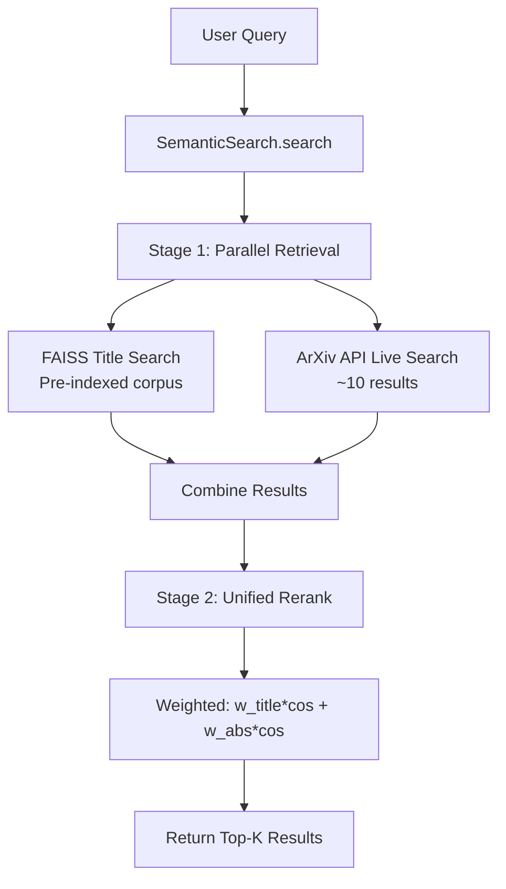

# ArXiv API Integration Plan

## Goal
Add arXiv API live search results (10 papers) to the semantic search pipeline and integrate them into the reranking phase alongside the pre-indexed FAISS corpus.

## Current State
- **[`semantic_search.py`](src/gap2idea/pipeline/semantic_search.py)**: `SemanticSearch` class with two-stage retrieval:
  - Stage 1: FAISS title-only retrieval (100 candidates)
  - Stage 2: Rerank using weighted title+abstract similarity
- **[`arxiv_api.ipynb`](notebooks/arxiv_api.ipynb)**: Contains `search_arxiv_with_pub_status()` function for live arXiv API queries

## Architecture



## Implementation Steps

### Step 1: Create ArXiv Search Module
Create [`src/gap2idea/pipeline/arxiv_search.py`](src/gap2idea/pipeline/arxiv_search.py) with:
- **`search_arxiv()`** function: Wrapper around the notebook's function, returns `List[Paper]`
- `arxiv_to_paper()` helper: Convert arXiv API results to `Paper` dataclass
- Include proper error handling and result limiting

### Step 2: Update SemanticSearch Class
Modify [`src/gap2idea/pipeline/semantic_search.py`](src/gap2idea/pipeline/semantic_search.py):

#### Add parameters to `__init__`:
```python
def __init__(
    self,
    model_name: str = "sentence-transformers/all-MiniLM-L6-v2",
    device: str = "cpu",
    batch_size: int = 128,
    use_precomputed_abstracts: bool = True,
    arxiv_max_results: int = 10,  # NEW: Number of arXiv results to include
    include_arxiv: bool = True,   # NEW: Toggle arXiv API search
):
```

#### Update `search()` method:
```python
def search(
    self,
    query: str,
    top_k: int = 10,
    stage1_candidates: int = 100,
    w_title: float = 0.4,
    w_abs: float = 0.6,
    arxiv_max_results: int = None,  # Override instance setting
) -> List[Tuple[Paper, float]]:
```

### Step 3: Implement Combined Search Logic

**Stage 1: Parallel Retrieval**
- Run FAISS search on pre-indexed corpus
- Run arXiv API live search (if enabled)

**Stage 2: Unified Reranking**
- For FAISS results: Use precomputed embeddings for reranking
- For arXiv results: Compute embeddings on-the-fly
- Combine all results and sort by weighted score

**Score Formula** (same for both sources):
```
score = w_title * cos(query, title) + w_abs * cos(query, abstract)
```

### Step 4: Update Streamlit App
Modify [`src/gap2idea/app/streamlit_app.py`](src/gap2idea/app/streamlit_app.py):

- Add toggle for arXiv API search in the UI
- Update search call to include arXiv results
- Display arXiv results alongside FAISS results with source indicator

### Step 5: Handle Source Attribution
Add source field to result dictionary:
```python
{
    'id': paper.paper_id,
    'title': paper.title,
    'abstract': paper.abstract,
    'cluster': cluster_id,
    'score': score,
    'source': 'faiss' | 'arxiv'  # NEW: Track origin
}
```

## File Changes Summary

| File | Change Type | Description |
|------|-------------|-------------|
| `src/gap2idea/pipeline/arxiv_search.py` | NEW | ArXiv API search module |
| `src/gap2idea/pipeline/semantic_search.py` | MODIFY | Add arXiv integration to search |
| `src/gap2idea/app/streamlit_app.py` | MODIFY | Update UI for arXiv toggle |

## Configuration Options

| Parameter | Default | Description |
|-----------|---------|-------------|
| `arxiv_max_results` | 10 | Number of arXiv results to include |
| `include_arxiv` | True | Toggle arXiv API search |
| `arxiv_categories` | None | Filter by arXiv categories (e.g., ['cs.AI', 'cs.LG']) |
| `arxiv_published_only` | False | Only include published papers |

## Result Format

Search results will include source attribution:
```python
# Example result
{
    'id': '2501.12345',
    'title': 'Explaining Synergetic Effects in Social Recommendations',
    'abstract': '...',
    'cluster': 3,
    'score': 0.85,
    'source': 'arxiv',  # or 'faiss'
    'arxiv_url': 'http://arxiv.org/abs/2501.12345',
    'pdf_url': 'http://arxiv.org/pdf/2501.12345.pdf'
}
```
