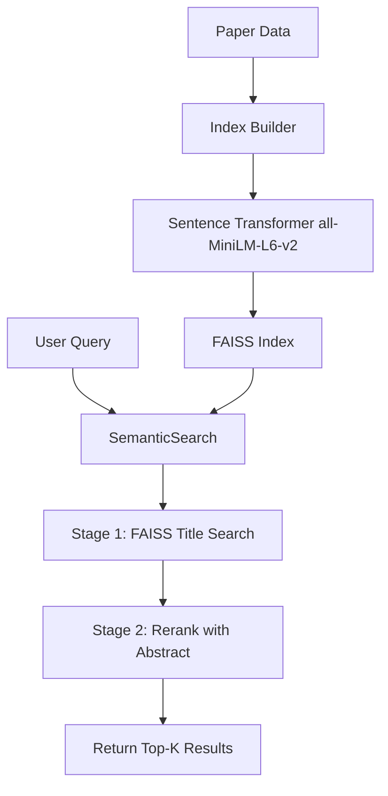

# Semantic Search Implementation Plan

## Current State
The [`streamlit_app.py`](src/gap2idea/app/streamlit_app.py:127) uses `SequenceMatcher` for string-based similarity search:
```python
sim = SequenceMatcher(None, query.lower(), p['title'].lower()).ratio()
```

## Goal
Replace with semantic search using sentence-transformers and FAISS, as implemented in [`search.ipynb`](notebooks/search.ipynb:622).

## Implementation Steps

### Step 1: Add FAISS Dependency
Update [`requirements.txt`](requirements.txt:1) and [`pyproject.toml`](pyproject.toml:6):
```
faiss-cpu
```

### Step 2: Create Semantic Search Module
Create [`src/gap2idea/pipeline/semantic_search.py`](src/gap2idea/pipeline/semantic_search.py) with:
- `Paper` dataclass (paper_id, title, abstract)
- `l2_normalize()` function
- `build_ip_index()` function for FAISS
- `SemanticSearch` class with:
  - Two-stage retrieval (title FAISS → rerank with abstract)
  - Weighted scoring: `score = w_title*cos(q, title) + w_abs*cos(q, abstract)`
  - Support for precomputed or on-demand abstract embeddings

### Step 3: Create Index Builder Script
Create [`scripts/build_search_index.py`](scripts/build_search_index.py) to:
- Load paper data from `gaps_with_clusters.tsv`
- Generate embeddings using `sentence-transformers/all-MiniLM-L6-v2`
- Save FAISS index and paper metadata to `artifacts/`

### Step 4: Modify Streamlit App
Update [`streamlit_app.py`](src/gap2idea/app/streamlit_app.py:114) to:
- Replace `SequenceMatcher` with `SemanticSearch` class
- Use cached FAISS index loading
- Implement semantic search with configurable weights (w_title=0.4, w_abs=0.6)

## Architecture



## Key Design Decisions
1. **Precomputed abstracts**: Store abstract embeddings for faster queries
2. **Persist index**: Save FAISS index to `artifacts/` for reuse
3. **Same embedder**: Use `all-MiniLM-L6-v2` (already in use)
4. **Backward compatible**: Fallback to string search if embeddings unavailable
